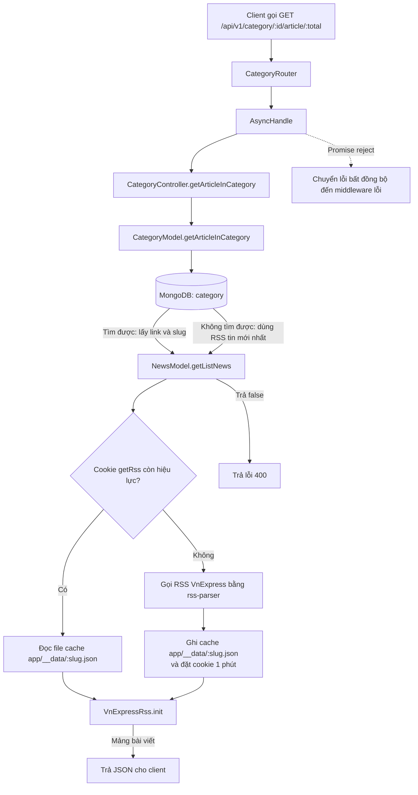

# Luồng `GET /api/v1/category/:id/article/:total`

## Mục đích

Endpoint lấy danh sách bài viết RSS của một chuyên mục đã lưu trong MongoDB. Mỗi category cần có:

```json
{
  "name": "Thể thao",
  "slug": "the-thao",
  "link": "https://vnexpress.net/rss/the-thao.rss"
}
```

- `id`: `_id` MongoDB của category.
- `total`: đang là một phần của URL nhưng **chưa được code hiện tại sử dụng** để giới hạn số bài viết.

Ví dụ request:

```http
GET /api/v1/category/68d123456789abcdef012345/article/10
```

## Sơ đồ luồng chạy



## Diễn giải theo từng lớp

### 1. Router

Trong `app/router/category.ts`:

```ts
this.router.get('/:id/article/:total', AsyncHandle(CategoryController.getArticleInCategory));
```

Vì category router được mount tại `/api/v1/category`, URL đầy đủ là:

```txt
/api/v1/category/:id/article/:total
```

Express lấy hai tham số đường dẫn trong `req.params`:

```ts
{
  id: '68d123456789abcdef012345',
  total: '10'
}
```

`AsyncHandle` bọc hàm async. Nếu hàm ném lỗi hoặc Promise bị reject, nó gọi `next(error)` để middleware xử lý lỗi.

### 2. Controller

`CategoryController.getArticleInCategory` gọi model:

```ts
const data = await CategoryModel.getArticleInCategory({ req, res }, {});
```

Nếu model trả về `false` hoặc giá trị falsy, controller chuyển sang lỗi:

```ts
next(new ErrorResponse(400, 'Đường dẫn không hợp lệ'));
```

Ngược lại, controller gửi HTTP 200:

```json
{
  "success": true,
  "data": []
}
```

### 3. Category model

`CategoryModel.getArticleInCategory`:

1. Dùng `req.params.id` để tìm category trong MongoDB.
2. Lấy `link` (RSS URL) và `slug` của category tìm được.
3. Truyền chúng sang `NewsModel.getListNews`.

```ts
const item = await MainModel.findById(params.req.params.id).select({});
params.link = item?.link;
params.slug = item?.slug;
return await NewsModel.getListNews(params, {});
```

### 4. News model: cache hoặc RSS online

`NewsModel.getListNews` dùng:

- `params.link` để xác định RSS feed cần đọc.
- `params.slug` để xác định file cache: `app/__data/<slug>.json`.
- Cookie `getRss` để tránh gọi RSS liên tục trong 1 phút.

| Điều kiện | Hành động |
| --- | --- |
| `getRss >= Date.now()` | Đọc file cache và xử lý dữ liệu từ file. |
| Cookie không tồn tại hoặc đã hết hạn | Gọi feed RSS online, lưu `feed.items` vào file cache, rồi xử lý dữ liệu. |

Khi gọi online thành công, server đặt cookie:

```ts
res.cookie('getRss', Date.now() + 60 * 1000);
```

### 5. Chuẩn hóa bài viết RSS

`VnExpressRss.init` chuyển mỗi RSS item thành:

```json
{
  "title": "Tiêu đề bài viết",
  "link": "https://vnexpress.net/...",
  "pubDate": "22-09-2026 03:30:00 PM",
  "image": "https://...jpg",
  "content": "Mô tả bài viết"
}
```

Nó cũng bỏ ký tự escape `\\\"` trong HTML content trước khi dùng regex lấy URL ảnh của thẻ ``.

## Lưu ý hiện tại

1. `:total` chưa được đọc ở controller hoặc model, nên request `/article/1` và `/article/100` hiện đều trả về cùng số lượng bài mà RSS cung cấp. Muốn áp dụng nó, cần đọc `req.params.total`, ép sang số an toàn, rồi dùng `data.slice(0, total)`.
2. Cookie `getRss` dùng chung cho toàn bộ category của cùng một client. Nếu client vừa gọi một category online, sau đó gọi category khác trong vòng một phút nhưng file cache của category đó chưa tồn tại, việc đọc cache có thể lỗi.
3. Nếu category không tồn tại, `link`/`slug` là `undefined`; `NewsModel` sẽ rơi về RSS tin mới nhất và slug `news`. Vì vậy, kiểm tra `item` ngay sau `findById` sẽ rõ ràng hơn nếu muốn trả 404 cho category không tồn tại.
